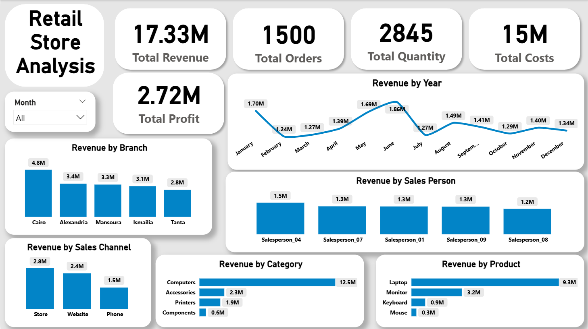

# 📊 Enterprise Retail Performance & Financial Analyst | Power BI Dashboard

> A comprehensive, corporate-grade two-page Power BI dashboard built as part of the **NGI Data Internship** (Ongoing). This project delivers deep commercial insights, revenue tracking, financial analysis, and operational metrics for retail store performance.

---

## 📂 Repository Structure & Project Files

This repository contains all necessary resources to run, review, and interact with the project:

* 📊 **Interactive Power BI Report:** [`NGI Internship.pbix`](./NGI%20Internship.pbix) *(Download & open in Power BI Desktop for full interactivity)*
* 📂 **Dataset:** [`data_detective_sales_training.csv`](./data_detective_sales_training.csv) *(Raw retail sales dataset)*
* 🖼️ **Executive Dashboards:** High-resolution preview screenshots included below.

---

## 📌 Project Overview
This project focuses on transforming raw retail data into actionable, executive-level insights using **Microsoft Power BI** and **DAX**. The solution is structured into two meticulously designed pages following a minimalist, clean, and modern corporate aesthetic (Corporate Blue theme) to optimize space usage and visual flow.

---

## 📊 Dashboard Preview

Below are high-resolution snapshots of the interactive **Power BI** dashboard pages:

### 1️⃣ Page 1: Overview (`Overview`)
- **Focus:** Commercial performance, top-line revenue, and sales drivers.
- **Key Metrics (KPI Cards):** `Total Revenue`, `Total Orders`, `Total Quantity`, `Total Costs`, and `Total Profit`.

---

### 2️⃣ Page 2: Financial Analyst (`Financial Analyst`)
- **Focus:** Financial health, operational insights, returns, and cost analysis.
- **Key Metrics (KPI Cards):** `Total Returned`, `Return Rate %`, `Profit Margin %`, and `Total Discounts`.

---

## 🛠️ Tools & Technologies Used
- **Microsoft Power BI Desktop:** Data modeling, custom visual formatting, and visual storytelling.
- **DAX (Data Analysis Expressions):** Implemented advanced DAX measures and custom calculated columns to compute precise financial and operational metrics (e.g., Net Revenue, Profit Margins, Return Rates, and auxiliary sort columns).
- **Power Query:** Data cleaning, transformation, and shaping.
- **Git & GitHub:** Version control, project structure, and professional documentation.

---

## 🚀 Key Learnings & Highlights
- Leveraged robust **DAX formulas** to handle complex financial calculations, percentage metrics, and data modeling logic.
- Designed a clean, distraction-free corporate dashboard avoiding redundant elements (stripped "Total" prefixes from chart titles for a modern UI).
- Managed complex data modeling relationships and auxiliary sort columns for proper chronological ordering (e.g., Days of the week).
- Balanced high-level financial KPIs with granular operational metrics across a structured multi-page layout.

---
*Developed by **Yahia Farag** as part of the **NGI Data Internship**.*
